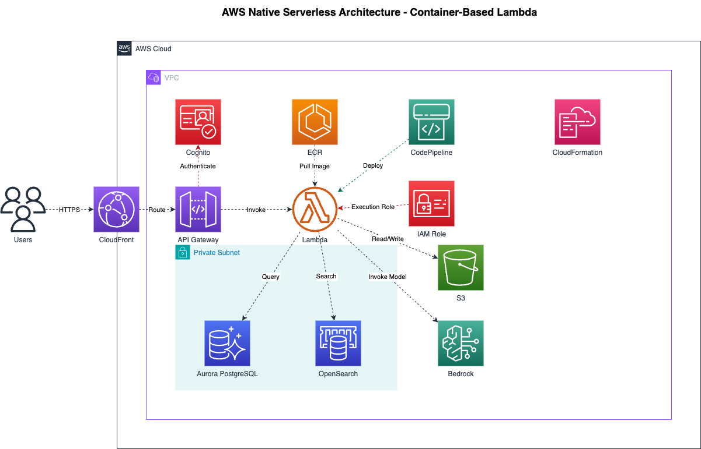

# 🎨 Draw.io MCP Server

!!! warning "Pre-Release Alpha Software"
This software is in pre-release alpha. Please share issues or suggestions for improvements.

Create, read, and update draw.io diagrams programmatically using AI assistants.

## 🚀 What is This?

The draw.io MCP server enables AI assistants to build technical diagrams on your local computer through natural language. Ask for an AWS architecture diagram, a flowchart, or a network topology—and watch it appear in draw.io format.

## 🏗️ Architecture

The project consists of two main components:

- **DrawIO JSAPI** - A JavaScript/TypeScript library that manipulates [mxGraph](https://github.com/jgraph/mxgraph) XML structures
- **MCP Server** - A Model Context Protocol server that exposes diagram operations to AI assistants

The JSAPI operates independently of draw.io or mxGraph runtime dependencies, working in both Node.js and browser environments.

## 🔒 Privacy First

All operations run entirely on your local machine. No diagram data, telemetry, or information is transmitted over the network.

## ✨ Key Features

- 📊 Create architecture diagrams with AWS, Kubernetes, and more icons!
- 🔄 Programmatically modify existing diagrams
- 🎯 Natural language diagram creation through AI assistants
- 🌐 Works in Node.js and browser environments
- 🔐 100% local operation with no network dependencies

## 🎯 Quick Example

```
You: "Create an AWS serverless architecture diagram with CloudFront, API Gateway,
container-based Lambda (pulling from ECR), connecting to Aurora PostgreSQL,
OpenSearch, S3, and Bedrock. Include Cognito for authentication, IAM roles,
and CodePipeline for deployment. Show the VPC and private subnet structure."

AI: [Generates a properly formatted draw.io diagram with official AWS icons]
```



_Example AWS architecture diagram generated by the MCP server. The resulting .drawio file can be edited manually in draw.io or programmatically by AI assistants like Kiro._

## Getting Started

See the [Installation Guide](INSTALLATION.md) for setup instructions with Kiro CLI or other MCP-compatible clients.

## 📚 Documentation

- **[JSAPI](jsapi/)** - JavaScript API documentation for programmatic diagram creation
- **[Examples](jsapi/EXAMPLES.md)** - Working code examples and tutorials
- **[Contributing](contributing/)** - Guidelines for contributing to the project
