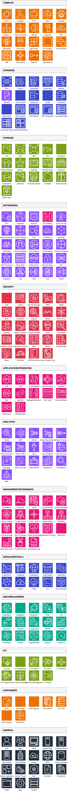

# AWS Icons Catalog

This catalog displays all AWS icons available in the DrawIO JSAPI and MCP server.



## Categories

The AWS icon library includes the following categories:

- **Compute** - EC2, Lambda, ECS, EKS, Fargate, Batch, Elastic Beanstalk, Lightsail, Outposts, App Runner, and more
- **Database** - RDS, Aurora, DynamoDB, ElastiCache, Neptune, Redshift, DocumentDB, Keyspaces, QLDB, Timestream
- **Storage** - S3, EFS, EBS, FSx, Glacier, Storage Gateway, Backup, Snowball, Snowball Edge, Snowcone
- **Networking** - VPC, CloudFront, Route 53, API Gateway, Direct Connect, Global Accelerator, Transit Gateway, ELB, PrivateLink
- **Security** - IAM, Cognito, Secrets Manager, KMS, WAF, Shield, GuardDuty, Inspector, Macie, Security Hub
- **Application Integration** - SQS, SNS, EventBridge, Step Functions, AppSync, MQ, SWF, Managed Workflows for Apache Airflow
- **Analytics** - Athena, EMR, Kinesis, QuickSight, Glue, Data Pipeline, Lake Formation, MSK, Redshift
- **Management & Governance** - CloudWatch, CloudFormation, CloudTrail, Config, Systems Manager, OpsWorks, Service Catalog, Trusted Advisor
- **Developer Tools** - CodeCommit, CodeBuild, CodeDeploy, CodePipeline, Cloud9, X-Ray, CodeStar, CodeArtifact
- **Machine Learning** - SageMaker, Rekognition, Comprehend, Translate, Polly, Transcribe, Lex, Personalize, Forecast, Textract, Bedrock
- **IoT** - IoT Core, IoT Greengrass, IoT Analytics, IoT Device Management, IoT Events, IoT SiteWise, FreeRTOS
- **Containers** - ECS, EKS, ECR, Fargate, App Runner, Copilot, Red Hat OpenShift
- **General** - AWS Cloud, Region, Availability Zone, Edge Location, Client, User, Mobile Client, and more

## Usage

To use AWS icons in your diagrams, reference them by their icon ID and category. For example:

```javascript
api.cells.insertAwsIcon({
  icon: "lambda",
  category: "compute",
  label: "Lambda Function",
  geometry: { x: 100, y: 100, width: 78, height: 78 },
});
```

Or using the lower-level API:

```javascript
import { buildResourceIconStyle } from "drawio-jsapi";

api.cells.insertVertex({
  label: "Lambda Function",
  geometry: { x: 100, y: 100, width: 78, height: 78 },
  style: buildResourceIconStyle({ icon: "lambda", fillColor: "#ED7100" }),
});
```

## Generating the Catalog

The catalog diagram is generated using the example at `jsapi/examples/icons/aws/`. To regenerate:

```bash
cd jsapi/examples/icons/aws
npm install
npm start
```
