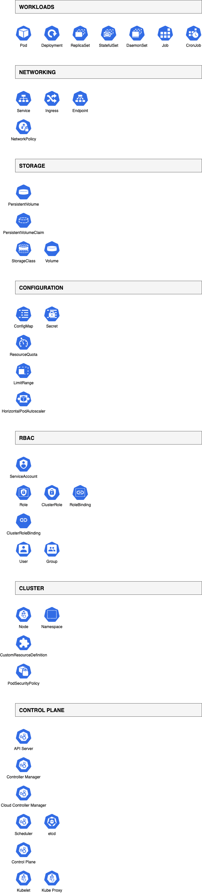

# Kubernetes Icons Catalog

This catalog displays all Kubernetes icons available in the DrawIO JSAPI and MCP server.



## Categories

The Kubernetes icon library includes the following categories:

- **Workloads** - Pod, Deployment, ReplicaSet, StatefulSet, DaemonSet, Job, CronJob
- **Networking** - Service, Ingress, NetworkPolicy, Endpoint
- **Storage** - PersistentVolume, PersistentVolumeClaim, StorageClass, Volume
- **Config** - ConfigMap, Secret
- **RBAC** - ServiceAccount, Role, RoleBinding, ClusterRole, ClusterRoleBinding
- **Cluster** - Node, Namespace
- **Control Plane** - API Server, Controller Manager, Scheduler, etcd, Cloud Controller Manager, Kubelet, Kube Proxy, DNS

## Usage

To use Kubernetes icons in your diagrams, reference them by their icon ID. For example:

```javascript
api.cells.insertVertex({
  label: "My Pod",
  geometry: { x: 100, y: 100, width: 50, height: 48 },
  style:
    "aspect=fixed;sketch=0;html=1;dashed=0;whitespace=wrap;verticalLabelPosition=bottom;verticalAlign=top;fillColor=#326CE5;strokeColor=#ffffff;shape=mxgraph.kubernetes.icon2;prIcon=pod;",
});
```

## Generating the Catalog

The catalog diagram is generated using the example at `jsapi/examples/icons/k8s/`. To regenerate:

```bash
cd jsapi/examples/icons/k8s
npm install
npm start
```
