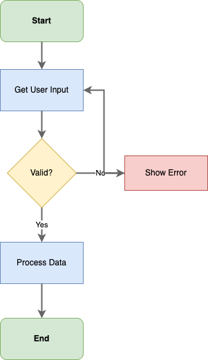
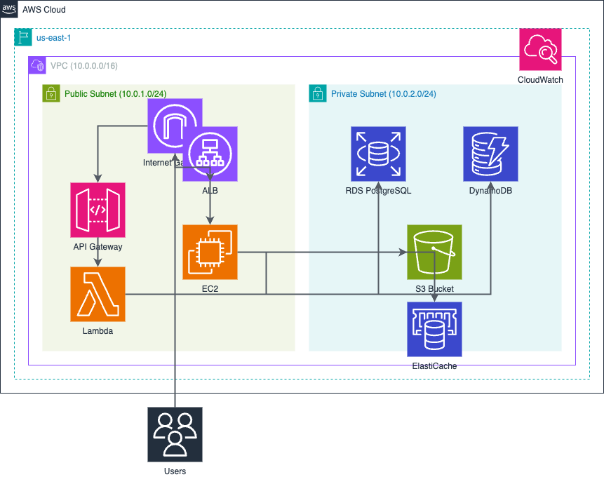

# Examples

The `jsapi/examples/` directory contains working demonstrations of the DrawIO JSAPI in Node.js applications.

## Available Examples

### hello-drawio

Creates a basic flowchart with shapes and connections. Demonstrates core JSAPI features including:

- Creating a diagram engine
- Inserting vertices (shapes)
- Connecting shapes with edges
- Applying styles
- Saving to a `.drawio` file

**Output:**



### hello-aws4

Builds an AWS architecture diagram using official AWS service icons. Shows how to:

- Use the AWS4 stencil library
- Insert AWS service icons (Lambda, S3, RDS, etc.)
- Create AWS grouping containers (VPC, Availability Zones)
- Connect services with labeled edges

**Output:**



### custom-icon

Demonstrates how to use custom images (SVG and PNG) in diagrams. Shows six different methods for adding custom icons:

- Using `insertImageVertex()` with SVG content
- Using `insertImageVertex()` with PNG data
- Using `insertVertex()` with manual style objects
- Using `insertVertex()` with style strings
- Custom styling with shadows and opacity
- Controlling aspect ratio

**Key features:**

- `createSvgDataUri()` - Convert SVG strings to data URIs
- `createImageDataUri()` - Convert image buffers to data URIs
- `insertImageVertex()` - Convenience method for image vertices
- Base64 encoding of custom images
- Embedded vs external image trade-offs

**Output:**

A diagram with six smiley face icons demonstrating different embedding techniques.

## Running the Examples

Each example is a standalone Node.js project that uses the JSAPI as a local dependency.

### Prerequisites

- Node.js 18 or later
- The JSAPI must be built first

### Build the JSAPI

From the repository root:

```bash
cd jsapi
npm install
npm run build
```

### Run an Example

Navigate to the example directory and run:

```bash
cd jsapi/examples/hello-drawio
npm install
npm start
```

For the AWS example:

```bash
cd jsapi/examples/hello-aws4
npm install
npm start
```

For the custom icon example:

```bash
cd jsapi/examples/custom-icon
npm install
npm start
```

### Output

Each example generates a `.drawio` file in the example's directory. The output location is displayed in the console when the script completes.

## Opening Generated Diagrams

The generated `.drawio` files can be opened with:

- **[diagrams.net](https://app.diagrams.net/)** - Web-based editor (no installation required)
- **[draw.io Desktop](https://www.diagrams.net/)** - Standalone desktop application
- **[VS Code Draw.io Integration](https://marketplace.visualstudio.com/items?itemName=hediet.vscode-drawio)** - VS Code extension for editing diagrams

## Modifying Examples

The example scripts are well-commented and can be modified to experiment with different diagram structures, styles, and layouts. Each script demonstrates a different aspect of the JSAPI capabilities.
