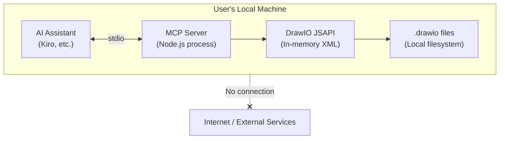

### Architecture Overview

```mermaid
flowchart TB
    subgraph local["User's Local Machine"]
        AI["AI Assistant<br/>(Kiro, etc.)"]
        MCP["MCP Server<br/>(Node.js process)"]
        JSAPI["DrawIO JSAPI<br/>(In-memory XML)"]
        Files[".drawio files<br/>(Local filesystem)"]

        AI <-->|"stdio"| MCP
        MCP --> JSAPI
        JSAPI --> Files
    end

    Internet["Internet / External Services"]
    local -.-x|"No connection"| Internet
```
