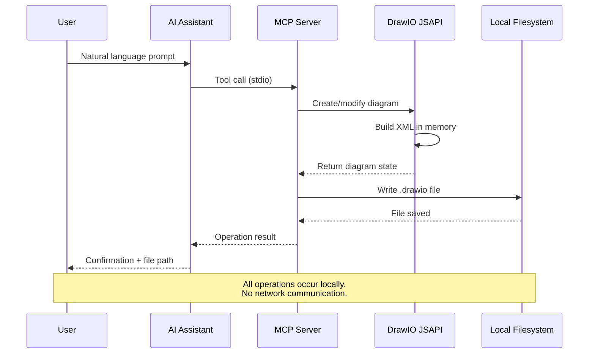

### Data Flow Sequence

```mermaid
sequenceDiagram
    participant User
    participant AI as AI Assistant
    participant MCP as MCP Server
    participant JSAPI as DrawIO JSAPI
    participant FS as Local Filesystem

    User->>AI: Natural language prompt
    AI->>MCP: Tool call (stdio)
    MCP->>JSAPI: Create/modify diagram
    JSAPI->>JSAPI: Build XML in memory
    JSAPI-->>MCP: Return diagram state
    MCP->>FS: Write .drawio file
    FS-->>MCP: File saved
    MCP-->>AI: Operation result
    AI-->>User: Confirmation + file path

    Note over User,FS: All operations occur locally.<br/>No network communication.
```
